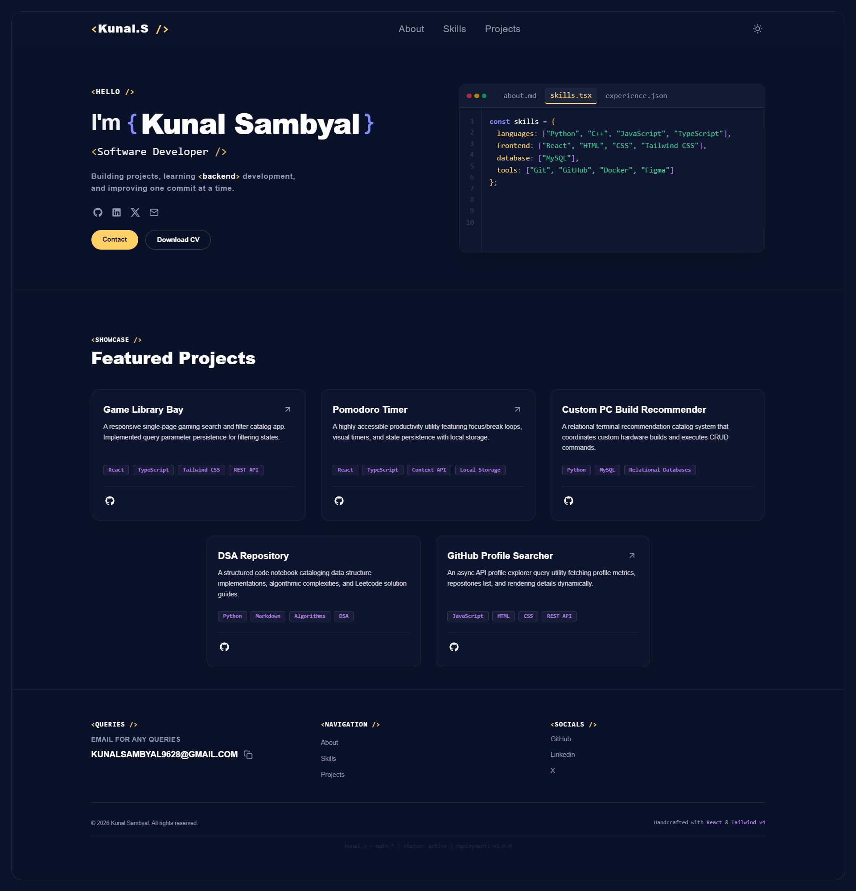

# Code-Crafted Developer Portfolio

A state-of-the-art, 100/100 Lighthouse-optimized developer portfolio built with a Code-Crafted Royale aesthetic, featuring an interactive mock IDE, responsive layouts, and WCAG AA accessibility compliance.

---

## Tech Stack

- **Core**: React + TypeScript + Vite
- **Styling**: Tailwind CSS v4 (CSS-First configuration)
- **Icons**: React Icons
- **Typography**: Google Fonts API (Outfit, Inter, Fira Code)

---

## Preview



---

## File Structure

```text
Portfolio/
├── README.md                           # This project overview
└── frontend/
    ├── public/                         # Static assets (Favicons, PDFs, robots.txt)
    └── src/
        ├── App.tsx
        ├── main.tsx
        ├── index.css                   # Tailwind configuration & global style overrides
        ├── context/
        │   └── TabBarContext.tsx       # Global React context for editor tab switching
        ├── data/
        │   └── projects.json           # Centralized showcase JSON dataset
        └── components/
            ├── layout/
            │   ├── Frame.tsx           # Viewport layout boundary
            │   ├── Navbar.tsx          # Keyboard-accessible sticky header
            │   └── NavLinks.tsx        # Shared layout link navigator
            ├── hero/
            │   ├── Hero.tsx            # Responsive 12-column fold wrapper
            │   ├── TextContent.tsx     # Bio headers & code brackets styling
            │   ├── SocialIcons.tsx     # Accessible social links row
            │   └── CtaButton.tsx       # Capsule interactive CTA button
            ├── ide/
            │   ├── IdeWidget.tsx       # Mock IDE editor outer shell
            │   ├── TabBar.tsx          # Header file tab selectors
            │   ├── Editor.tsx          # Active component router
            │   ├── LineNumbers.tsx     # Fixed vertical line numbers column
            │   ├── CodeElements.tsx    # DSL tags syntax coloring helper
            │   └── content/            # Tab display content (Skills, Experience, About)
            └── footer/
                ├── Footer.tsx          # Sub-footer grid layout coordinator
                ├── EmailQueries.tsx    # Click-to-clipboard email copy utility
                ├── QuickLinks.tsx      # Navigation list links
                ├── SocialLinks.tsx     # Text-based social links
                └── Copyright.tsx
```

---

## What I Have Learned

Building this portfolio helped reinforce advanced frontend engineering principles:

1. **State Management & Lifting**: Lifted local states to a global React Context (`TabBarContext`) to enable siblings (like Navbar and Footer) to reactively switch internal files in the mock IDE widget.
2. **Clean & Modular Architecture**: Refactored monolithic sections into single-responsibility subcomponents, decoupling layouts from data arrays.
3. **Performance Optimization**:
    - Optimized Tailwind transitions to target specific properties (`transform`, `border-color`, `background-color`), preventing browser lag during layouts resizes by excluding animated width/height.
    - Used compile-time static JSON imports (`import` inside Vite) instead of runtime fetches, keeping asset loading latency at 0ms.
4. **WCAG 2.1 AA Accessibility Guidelines**: Implemented semantic HTML5 layout tags, high-contrast keyboard outlines (`focus-visible:outline-cyber-yellow`), descriptive `aria-label` screen reader tags, and ARIA roles (`role="tablist"`, `role="tabpanel"`) to build an inclusive user experience.
5. **SEO Auditing**: Configured correct viewport tags, metadata description elements, robot crawler targets, and descriptive HTML titles to ensure a perfect 100 rating on Lighthouse SEO audits.

---

## Author

Kunal Sambyal
